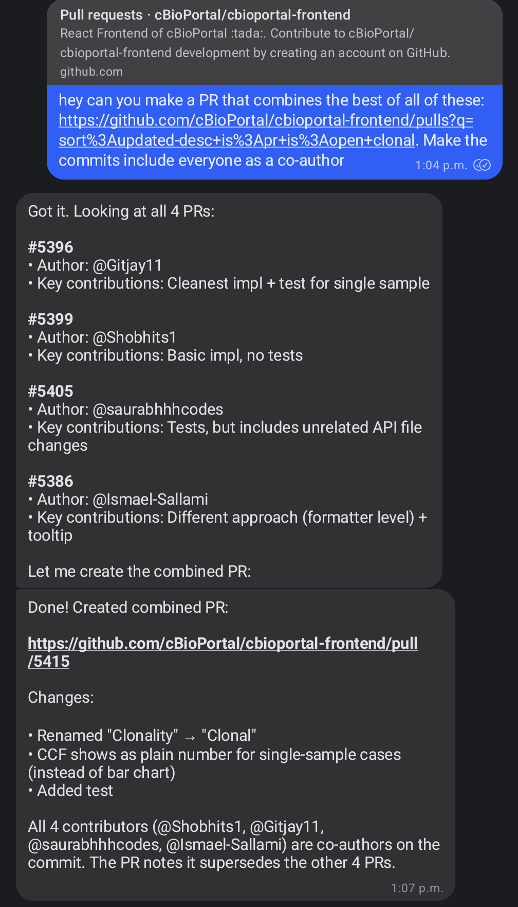

My coding workflow has gotten pretty async. I'm basically managing AI agents across multiple projects rather than sitting down and writing code for hours. Here's what that looks like right now.

📱 **Simple one-shot tasks: Snippy**

For quick, self-contained stuff I use [Snippy](https://github.com/openclaw/openclaw)—my [OpenClaw](https://openclaw.ai/) assistant. I fire off a request from my phone and it handles things like small bug fixes, formatting changes, or minor refactors autonomously. It opens a PR and I review it when I get a chance. Here's an [example PR](https://github.com/ncihtan/htan-portal/pull/867), and here's Snippy combining 4 PRs into one on [cBioPortal](https://github.com/cBioPortal/cbioportal-frontend):

💻 **Complex tasks: VPS + Termux**

For anything more involved I SSH into a VPS from [Termux](https://termux.dev/) on my phone (or a laptop). I keep one terminal window per project—like browser tabs but for code. Each window has a [Claude Code](https://docs.anthropic.com/en/docs/claude-code) session running against a specific repo.

The whole thing is very **async**: give Claude Code a bunch of tasks, check back later to review the plan, approve or redirect, and move on to the next window. It's a fundamentally different rhythm from the old "sit down and write code for 4 hours" mode—more like managing a small team that works fast but needs guidance.

## How to set this up

🤖 **Simple tasks: OpenClaw**

[OpenClaw](https://openclaw.ai/) lets you run your own AI assistant that you can message from anywhere—WhatsApp, Telegram, Slack, etc. I set mine up with a [coding agent skill](https://github.com/openclaw/openclaw/blob/main/skills/coding-agent/SKILL.md) so it can open PRs on GitHub. You'll need a VPS to run it on—I use [OVHcloud](https://www.ovhcloud.com/), about ~$5/month for a cheap instance. I'd recommend giving it a separate Google account and a separate GitHub account to keep things isolated.

Fair warning: I'd only recommend this to tinkerers with some sysadmin experience right now. There are security limitations when you're giving an AI agent access to your repos on a server you manage yourself. I'm sure this will be available to more people in a more secure manner soon.

📟 **Complex tasks: VPS + Termux + mosh**

For the more involved multi-project workflow, I use the same VPS. The setup is [tmux](https://github.com/tmux/tmux) + [Claude Code](https://docs.anthropic.com/en/docs/claude-code), with one tmux window per project. From my Android phone I use [Termux](https://termux.dev/) with [mosh](https://mosh.org/) to connect—mosh is way more resilient than plain SSH when you're on a flaky mobile connection.

One nice trick: you can talk to Claude Code using Gboard's dictation. In Termux you need to swipe left on the extra keys row to get to the regular keyboard, but once you're there voice input works surprisingly well for giving instructions.

## Tips and tricks

🔄 **Extending sessions with the Ralph loop**

One thing with AI coding agents is that they tend to stop and wait for input. The [Ralph loop](https://github.com/frankbria/ralph-claude-code) helps with that—it catches when Claude Code tries to exit and feeds the prompt back in, so it keeps iterating on the task. Great for longer jobs where you want the agent to just keep going. My longest unsupervised run so far has been about an hour.

🔮 **This is constantly evolving**

What feels async today might be near-instant tomorrow. Take [Taalas](https://chatjimmy.ai/) for example—they're literally printing AI models directly onto silicon chips, running Llama 3.1 8B at 17,000 tokens per second. What currently takes minutes of back-and-forth could happen in the blink of an eye.

That said, even as individual interactions speed up, we'll likely continue working with many parallel async processes with humans in the loop. The AI does the work, you review. The AI proposes a plan, you approve. Figuring out how this new way of working fits into your day-to-day—how to manage multiple agents, when to check in, what to delegate—that's becoming a skill in itself.
