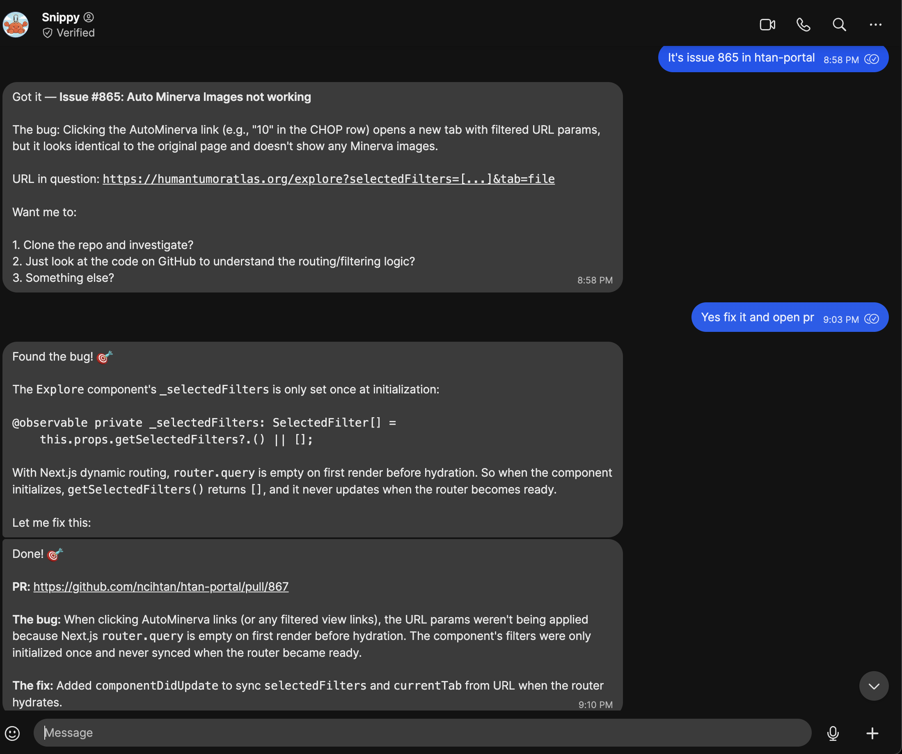
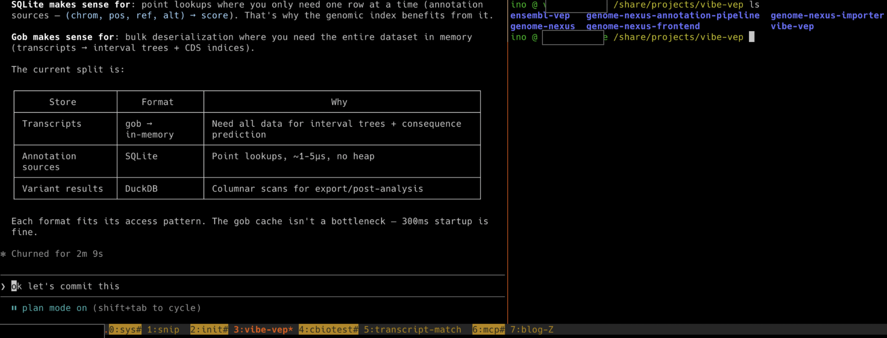

I've been evolving my coding workflow to more async agentic coding: checking in
on how the agents are doing on specific tasks and guiding them when necessary.
It's very similar to how one would manage a human software engineering team.
I'll give some example tasks below and describe how you can set this up for
yourself.

📱 **Simple one-shot tasks: Snippy**

For quick, self-contained stuff I use [Snippy](https://github.com/openclaw/openclaw)—my [OpenClaw](https://openclaw.ai/) assistant. I fire off a request from my phone and it handles things like small bug fixes, formatting changes, or minor refactors autonomously. It opens a PR and I review it when I get a chance. Here's an example where a collaborator emailed about something that needed to be fixed in our [HTAN portal](https://humantumoratlas.org/)—I just told Snippy to fix it via Signal and it immediately submitted a [fix](https://github.com/ncihtan/htan-portal/pull/867):

Some more examples:

- I needed to remove a banner from our website. I messaged the agent and immediately got a [PR](https://github.com/cBioPortal/cbioportal-frontend/pull/5401) to do so.
- I received a ton of PRs to fix an issue for cBioPortal, so I asked it to merge them into one combining the best of each (see [PR](https://github.com/cBioPortal/cbioportal-frontend/pull/5415))

💻 **Complex tasks: VPS + tmux**

For anything more involved I connect to a VPS—from my phone using [Termux](https://termux.dev/) with [mosh](https://mosh.org/), or from my MacBook via SSH. On the server I use [tmux](https://github.com/tmux/tmux/wiki) with one window per project, each running a [Claude Code](https://docs.anthropic.com/en/docs/claude-code) session. Here's what my current tmux session looks like:

- **0:sys** — System install stuff and server health management
- **1:snip** — Chat interface to Snippy, so beyond phone and email I can also talk to it directly on the server
- **2:init** — Starting new projects. I organize my work by projects, where a project might span multiple repos
- **3:vibe-vep** — Working on [vibe-vep](https://github.com/inodb/vibe-vep), a variant effect predictor. This project spans multiple repos as you can see in the screenshot
- **4:cbiotest** — Dealing with flaky tests in [cBioPortal](https://github.com/cBioPortal/cbioportal-frontend)
- **5:transcript-match** — A transcript alignment tool
- **6:mcp** — The [MCP project for cBioPortal](https://github.com/cBioPortal/cbioportal-mcp)
- **7:blog** — This blog post

The whole thing is very **async**: give Claude Code a bunch of tasks, check
back later to review the plan, approve or redirect, and move on to the next
window. It's a fundamentally different rhythm from the old "sit down and write
code for 4 hours" mode—more like managing a small team that works fast but
needs guidance. I'm coding way more from my phone now.

## How to set this up

🤖 **Simple tasks: OpenClaw**

[OpenClaw](https://openclaw.ai/) lets you run your own AI assistant that you
can message from anywhere—WhatsApp, Telegram, Slack, etc. I set mine up with a
[coding agent
skill](https://github.com/openclaw/openclaw/blob/main/skills/coding-agent/SKILL.md)
so it can open PRs on GitHub. The VPS setup is pretty much the same as described
in the complex tasks section below, except you'll want to create a separate user
with more limited permissions, a separate Google account, and a separate GitHub
account to keep things isolated.

Fair warning: I'd only recommend this to tinkerers with some sysadmin
experience right now. There are many potential security issues when you're
giving an AI agent access to all kinds of services. Prompt injection becomes a
major concern. I'm sure this will be available to more people in a more secure
manner soon.

📟 **Complex tasks: VPS + tmux + mosh**

1. **Get a VPS** — I use [OVHcloud](https://www.ovhcloud.com/), but any provider works. You want enough RAM for your coding agents to run comfortably.
2. **Set up a user and SSH** — Create a non-root user, set up SSH keys, and configure your firewall. Same as you'd do for any new server.
3. **Install your dependencies** — Git, Node, Python, Docker, whatever your projects need. I keep a [dotfiles repo](https://github.com/inodb/dotfiles) to help bootstrap new machines.
4. **Install [tmux](https://github.com/tmux/tmux/wiki)** — This is what lets you keep multiple sessions alive. One window per project.
5. **Install [mosh](https://mosh.org/)** — Way more resilient than plain SSH, especially on flaky mobile connections.
6. **Install your coding agent(s)** — [Claude Code](https://docs.anthropic.com/en/docs/claude-code), [GitHub Copilot CLI](https://docs.github.com/en/copilot), [Codex](https://openai.com/index/codex/), [Gemini CLI](https://github.com/google-gemini/gemini-cli), whichever you prefer.
7. **Connect from your phone** — On Android I use [Termux](https://termux.dev/) with mosh. One nice trick: you can talk to Claude Code using Gboard's dictation. In Termux you need to swipe left on the extra keys row to get to the regular keyboard, voice input works surprisingly well for giving instructions.

## Tips and tricks

🔄 **Extending sessions with the Ralph loop**

One thing with AI coding agents is that they tend to stop and wait for input.
The [Ralph loop](https://github.com/frankbria/ralph-claude-code) helps with
that—it catches when Claude Code tries to exit and feeds the prompt back in, so
it keeps iterating on the task. Great for longer jobs where you want the agent
to just keep going. My longest unsupervised run so far has been about an hour.
Hoping to get to the level of day long runs at some point (tips anyone?).

🛠️ **Configure your own workflow**

There are many ways to do this async style of software engineering—the various [coding assistant integrations available via Slack](https://slack.com/marketplace/category/At07HZAKCSAC-ai-apps-assistants) (like [Claude Code in Slack](https://code.claude.com/docs/en/slack)), [assigning issues to GitHub Copilot](https://docs.github.com/en/copilot/how-tos/use-copilot-agents/coding-agent) directly in the GitHub UI, using [Claude Code on the web](https://code.claude.com/docs/en/claude-code-on-the-web), and more. Each has its own pros and cons. My setup requires a lot of configuration and might not be ideal for others. I'd recommend experimenting to figure out what works best for you.

🔮 **This is constantly evolving**

What requires async interaction today might be near-instant tomorrow. Take
[Taalas](https://chatjimmy.ai/) for example—they're literally printing AI
models directly onto silicon chips, running Llama 3.1 8B at 17,000 tokens per
second. What currently takes minutes of back-and-forth could happen in the
blink of an eye.

That said, even as individual interactions speed up, we'll likely continue
working with many parallel async processes with humans in the loop. The AI does
the work, you review. The AI proposes a plan, you approve. Figuring out how
this new way of working fits into your day-to-day—how to manage multiple
agents, when to check in, what to delegate—that's becoming a skill in itself.
