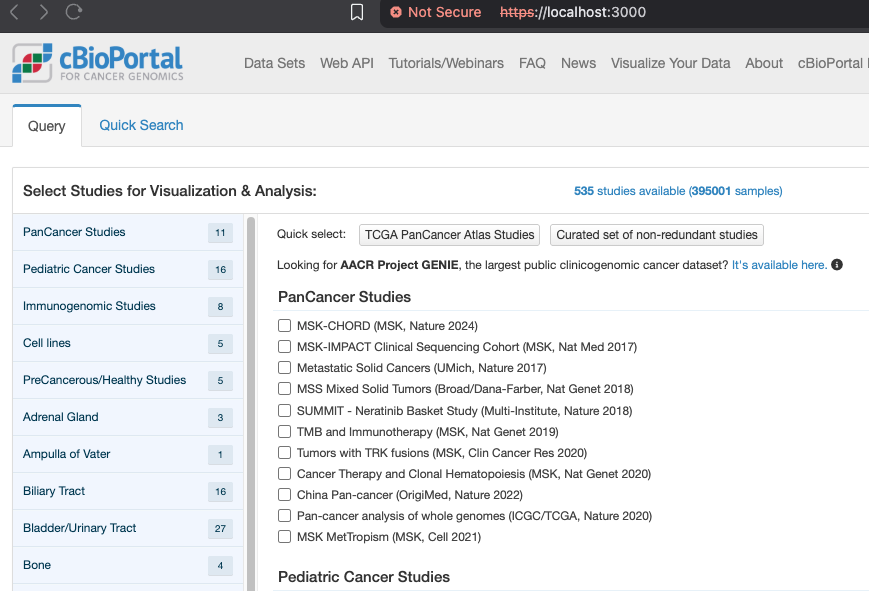
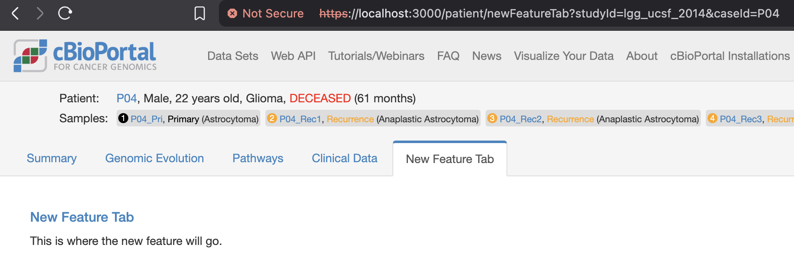
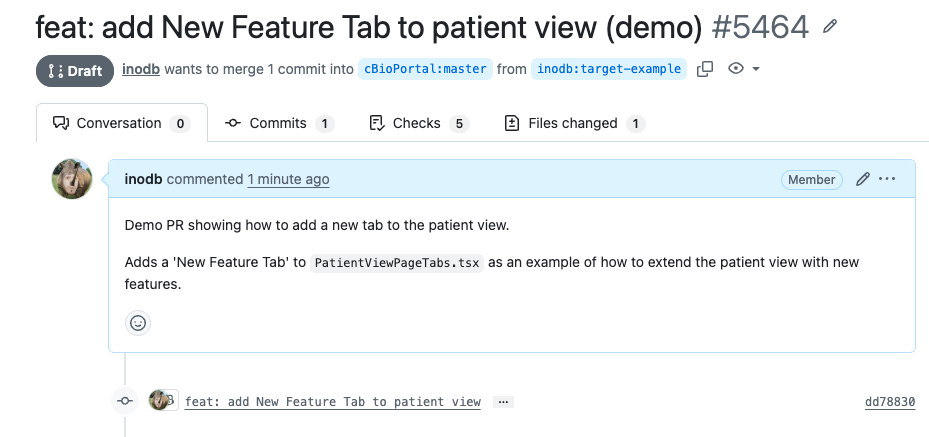
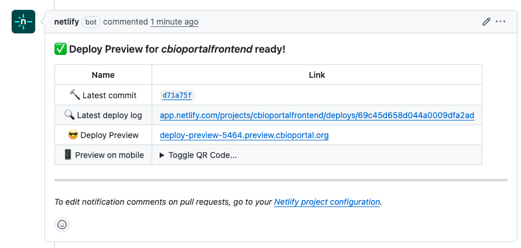

AI has commoditized software development. I think anybody can now build a cBioPortal feature. If you're an analyst familiar with Python and R, it's definitely within reach. But even if you have no coding experience, it's doable with some effort. You tell an AI coding agent what you want and watch it build.

This post walks through the entire workflow: from setup to a shareable preview URL.

## What you need

- A **terminal**. Terminal.app or [Termux](https://termux.dev/) on Mac, Windows Terminal, or any Linux terminal.
- An **AI coding agent**. [GitHub Copilot CLI](https://docs.github.com/en/copilot), [Claude Code](https://docs.anthropic.com/en/docs/claude-code), [Gemini CLI](https://github.com/google-gemini/gemini-cli), or [Codex](https://openai.com/index/codex/).
- A **GitHub account**.

You don't need to learn much about the command line anymore. It's all one command now: `claude`, `copilot`, `gemini`, or `codex`. After that it's just chatting. It won't judge you: ask it all the questions you never dared to ask your programming friend. By default it will ask if it's ok before executing a specific command, so you can see exactly what it does. And you can always ask follow-up questions if you're not sure.

## Setup: ask the agent

Open your terminal, start your agent, and tell it:

> 🤖 *"Clone https://github.com/cBioPortal/cbioportal-frontend, install dependencies, and run the project"*

The agent will handle everything: downloading the code, installing dependencies, and starting a local version of cBioPortal. You don't need to know what any of those steps mean. First-time setup takes about 15-20 minutes. After that, subsequent runs start in seconds.

Once it's running, visit **https://localhost:3000**. Your browser will show a security warning because you're running a local server. Just click "Accept risk and continue" when prompted.

Try a patient page to confirm it works:

https://localhost:3000/patient?studyId=lgg_ucsf_2014&caseId=P04

The data comes directly from **cbioportal.org**, so you get real public data out of the box. You should see the cBioPortal homepage:

### Not working?

Right-click anywhere in the browser, go to Inspect, then the Console tab. Copy the error and paste it into your agent. It'll diagnose and fix it for you.

## Add a new patient view tab

Tell the agent:

> 🤖 *"Add a new tab called 'My Feature' to the patient view page in cbioportal-frontend"*

The agent will figure out where to add the tab and create the necessary files for you. Your new tab shows up right away:

Want to understand the codebase better? Just ask:

> 🤖 *"Can you explain the codebase structure of cbioportal-frontend to me?"*

## Prototype with mock JSON data

Normally when you build a cBioPortal feature, you'd format your data into cBioPortal's expected format and import it into the database. That's a significant amount of work, especially if you're just trying to prototype an idea or see if a new visualization makes sense. During prototyping, you can skip the database entirely by including your data as a file directly in the code.

The file format used is JSON (JavaScript Object Notation), the standard data format on the web. If you've worked with spreadsheets or TSV files, it's a similar idea: structured data in rows and columns, just written in a format that web applications can read natively. You don't need to learn the format yourself though. Just ask the agent to convert your data.

Got a TSV or Excel file with your data? Tell the agent:

> 🤖 *"Convert my spreadsheet data.xlsx to a JSON file called mockData.json"*

Or have the agent generate realistic sample data from scratch:

> 🤖 *"Generate a JSON array of 10 mock cancer patients with fields: patientId, cancerType, age, tmbScore (mut/Mb), msiStatus, treatmentResponse. Use realistic but entirely fictional values."*

AI agents are great at generating realistic test data. Once you have your JSON file, the agent will hook it up so the data shows up in your tab. From there you can iterate on the visualization. Tell the agent to add a table, a chart, or whatever you have in mind, all using your own data.

> ⚠️ **Important:** cbioportal-frontend is a public GitHub repo. Any data you commit (including JSON files) is publicly visible, including in preview deployments. **Never commit real patient data or PHI of any kind.**

## Get a shareable preview link

A PR (pull request) is how you propose changes to a project on GitHub. It lets others review your code before it gets merged into the main project. Tell the agent:

> 🤖 *"Open a draft PR to cbioportal-frontend with my changes"*

Here's an example of a [PR opened by an agent](https://github.com/cBioPortal/cbioportal-frontend/pull/5464):

We've set up the cbioportal-frontend repo so that every PR automatically gets a [preview URL](https://deploy-preview-5464.preview.cbioportal.org/patient/newFeatureTab?studyId=lgg_ucsf_2014&caseId=P04) (build takes about 10-15 minutes):

Share the preview link with collaborators. They can see and interact with your feature without any setup on their end.

## Have fun building

The commoditization of software development means anybody can build features and perform analyses using natural language. A major challenge for scientists and software engineers has always been formulating the requirements. Now non-coders can define requirements in incredible detail by building fully working prototypes.

Whether you're a bioinformatician, clinician, or researcher: if you can describe what you want, you can build it. Pick a feature you've always wanted in cBioPortal, open your terminal, and start chatting.
