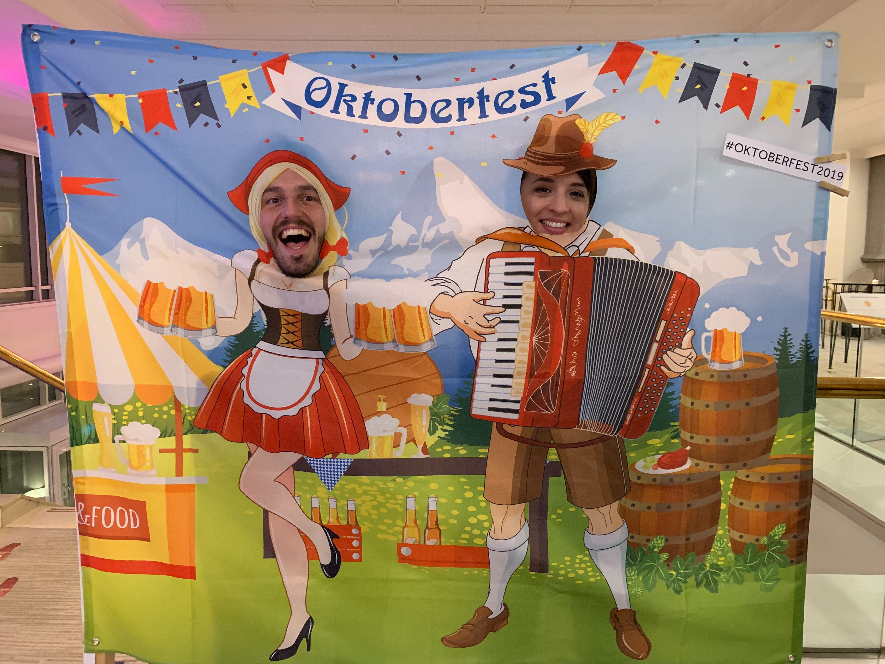
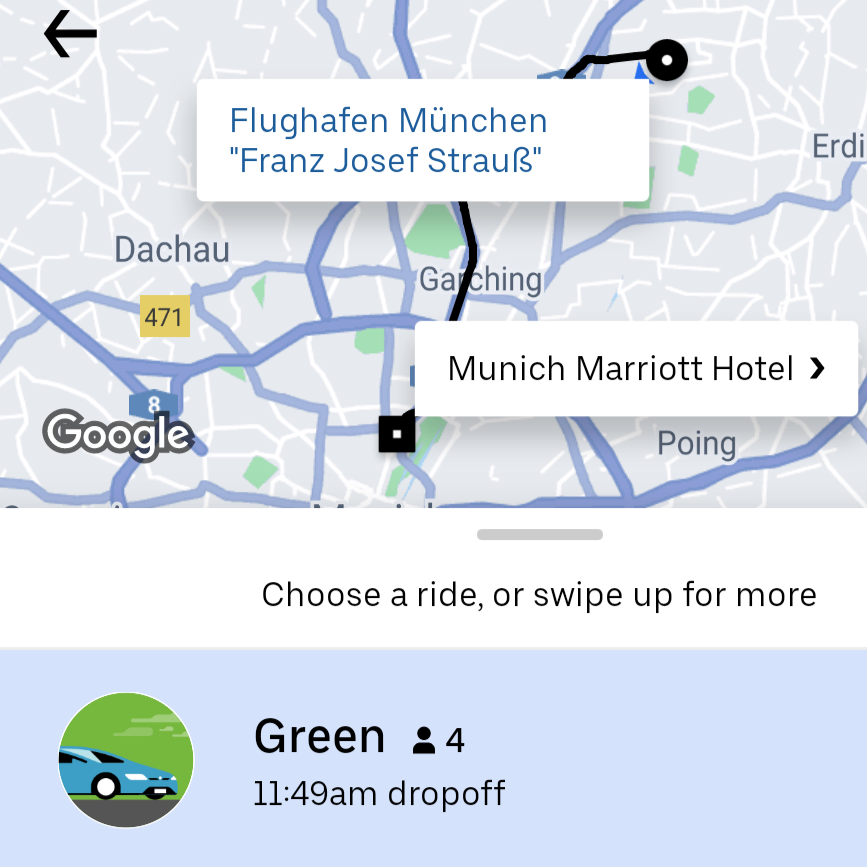
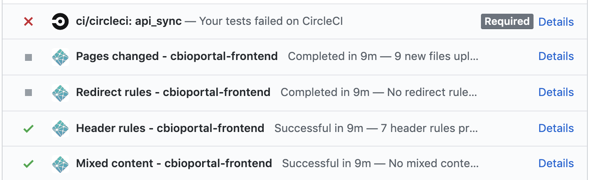
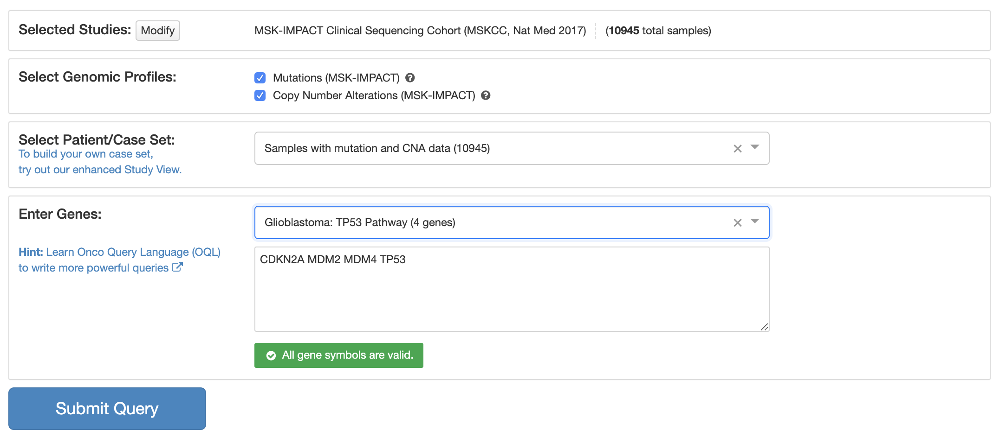

Just got to the airport in Munich after a successful [Google Summer of Code
(GSoC)](https://summerofcode.withgoogle.com/) Mentor Summit. This is a yearly
event where all open source organizations that participated in GSoC come
together. There are a few scheduled sessions but the rest follows the
unconference formula:

<blockquote class="twitter-tweet">
Really like the unconference idea: give participants a bunch of rooms and time slots and let them organize their own sessions. Participants know what will be useful to them! Doing an Open Source Bioinformatics session at 11am tomorrow (top left) <a href="https://t.co/OK0c9p1bTP">pic.twitter.com/OK0c9p1bTP</a>
&mdash; 🔧 Ino de Bruijn 🧬 (@inodb) <a href="https://twitter.com/inodb/status/1185167867664318465?ref_src=twsrc%5Etfw">October 18, 2019</a></blockquote>

I was there having a blast representing the
[cBioPortal](https://www.cbioportal.org) organization together with
[Angelica](https://twitter.com/angiee8aa).  This is us:

The [cBioPortal](https://www.cbioportal.org) organization had 6 students coding
over the summer, working on various projects related to the [Open Source
cBioPortal for Cancer Genomics website](https://www.cbioportal.org). The
majority of the contributors are at [Memorial Sloan Kettering Cancer
Center](https://www.mskcc.org) in New York but the users, a combination of
clinicians and researchers, live all over the world and so do its contributors.
For more information about cBioPortal see
[here](https://www.cbioportal.org/about). For a complete overview of the
student projects see [the cBioPortal GSoC
wiki](https://github.com/cBioPortal/GSoC/wiki/Google-Summer-of-Code-2019-Wrap-up).

Before I dive into the GSoC mentor summit and elaborate why it was useful to go
other than experiencing the great joys of drinking giant beers and eating wild
deer schnitzel; I need to share some experiences from Munich. I won't be
offended if you prefer to skip the next paragraph.

## Munich 🛴

I loved that the summit was in Munich this year. Last time I went (two years
ago) it was at the Google campus in Silicon Valley. That was cool, but it was
great to get the opportunity to visit a new place. Munich is a beautiful city
and has a lot to offer.

I had to be in Amsterdam the week before anyway, so I did not feel too bad
about my carbon impact from flying to Europe. I did take the train from
Amsterdam to Munich to save some carbon and more importantly: blog about my
pretentiousness later. Along the same vein I got to the airport just now by Green
Uber:

Haven't seen this back home in New York yet. The price was actually slightly
cheaper than Uber X. It was also my first time sitting in a Tesla Model 3. Not
the best user experience trying to open the car door lol; I wasn't able to get
in or out of the car without the driver explaining to me how to operate the
door. Munich had a bunch of other things I hadn't seen in New York: electric
scooters and bikes you can dump anywhere. Things do look slightly messy with
those scooters and bikes scattered all over the city but it was pretty
convenient. I didn't end up using the subway at all, because the weather was
perfect and it was so easy to rent scooters and bikes. In general I find the
experience of navigating a new city so much easier compared to a decade ago,
since you're using all the apps and interfaces you're familiar with from back
home. That being said I did end up doing some stupid tourist things using the
same apps. I took an electric scooter from Uber at night and Google Maps
pointed me to go through this unlit park. Halfway through the park the scooter
died on me. It was only then I realized that parking the scooter there would
get me a 25 euro fine. I ended up trying to push the scooter out of the park
before giving up and taking a cab back to the hotel.

## Lightning Talks ⚡️

The next morning, decently well rested, Angelica and me presented at the
Lightning Talks session. Organizations that signed up can tell a story about
their students in under three minutes, see our two slides here:

<iframe src="https://docs.google.com/presentation/d/e/2PACX-1vRFrVOWkw15JNQ-J1GATPc1bghAb1xZhdDsiPD9o1791dSopjUizfNw1utzjBIFmd0Ll7f9pFmX4Gee/embed?start=false&loop=true&delayms=3000" frameborder="0" width="480" height="299" allowfullscreen="true" mozallowfullscreen="true" webkitallowfullscreen="true"></iframe>

The lightning talks are a great way to get a quick overview of all the
different projects. My favorites were from [Vicky
Vergara](https://twitter.com/VickyVvergara) from the [Open Source Geospatial
Foundation](osgeo.org):

<blockquote class="twitter-tweet">
Watch the video <a href="https://twitter.com/OSGeo?ref_src=twsrc%5Etfw">@OSGeo</a>  <a href="https://twitter.com/gsoc?ref_src=twsrc%5Etfw">@gsoc</a>  2019 student Hang working on pgRouting<a href="https://t.co/llNxKPufXQ">https://t.co/llNxKPufXQ</a>
&mdash; vicky vergara (@VickyVvergara) <a href="https://twitter.com/VickyVvergara/status/1169997008389566465?ref_src=twsrc%5Etfw">September 6, 2019</a></blockquote>

and the Public Lab one presented by [Jeffrey Warren](https://twitter.com/jywarren):

<blockquote class="twitter-tweet">
I LOVE this slide from <a href="https://twitter.com/jywarren?ref_src=twsrc%5Etfw">@jywarren</a> - growing your community is what -gets- your work done, not something you do -instead- of work. <a href="https://twitter.com/PublicLab?ref_src=twsrc%5Etfw">@PublicLab</a> encourages recent new contributors to prepare github issues for newbies - great onboarding path! <a href="https://twitter.com/hashtag/gsoc?src=hash&amp;ref_src=twsrc%5Etfw">#gsoc</a> <a href="https://t.co/08peKo7zEl">pic.twitter.com/08peKo7zEl</a>
&mdash; yo yehudi🏳️‍🌈🇪🇺 (@yoyehudi) <a href="https://twitter.com/yoyehudi/status/1185465379776290818?ref_src=twsrc%5Etfw">October 19, 2019</a></blockquote>

## Unconference Sessions 🗣

### Managing a Welcoming Open Source Organization

Since I enjoyed [Jeffrey](https://twitter.com/jywarren)'s lighning talk so
much, I decided to go to his session:

<blockquote class="twitter-tweet">
Amazing effort by <a href="https://twitter.com/PublicLab?ref_src=twsrc%5Etfw">@PublicLab</a> to make <a href="https://twitter.com/hashtag/opensource?src=hash&amp;ref_src=twsrc%5Etfw">#opensource</a> contributing more inclusive: <a href="https://t.co/Ddz9Pu41lb">https://t.co/Ddz9Pu41lb</a>. Great session by <a href="https://twitter.com/jywarren?ref_src=twsrc%5Etfw">@jywarren</a> at <a href="https://twitter.com/hashtag/GSOC?src=hash&amp;ref_src=twsrc%5Etfw">#GSOC</a>. Feeling inspired!
&mdash; 🔧 Ino de Bruijn 🧬 (@inodb) <a href="https://twitter.com/inodb/status/1185862129372585984?ref_src=twsrc%5Etfw">October 20, 2019</a></blockquote>

I learned about the importance of language when writing contributing docs e.g.

<blockquote>"Please give back" vs "you have the ability to help others"</blockquote>

as well as the importance of visual aids. The GitHub checks give big red errors
when contributors submit their pull request which can be discouraging for
newcomers:

Showing this as a progress bar could be one way to make this less intimidating.

It was great to see in the session afterwards about *Bots for maintainers and
contributor onboarding* organized by [Oleg
Nenashev](https://twitter.com/oleg_nenashev) that another major project like
[Jenkins](https://github.com/jenkinsci) made great efforts to incorporate
similar ideas in their organization. [Kai Blin](https://twitter.com/kaiblin)
remarked that people find it sometimes less intimidating to see a bot message
something than him messaging the exact same thing himself. As an example he
mentioned linting, e.g. a message like "improve the code styling here and
here" was usually appreciated more when it came from a bot.
[Jeffrey](https://twitter.com/jywarren) added to this that in his
organization they try to let encouraging words come from a human, since that
is experienced as more welcoming. This leads to some interesting questions
for an organization regarding what type of work should be done by bots versus
humans. On the one hand it might be nice to automate parts of Pull Request
reviews by bots but on the other hand the same task could be good for a
relatively new contributor to the project so they feel good about
contributing and for a new contributor to feel appreciated by a human being.
I imagine metrics around contributor acquisition and what they end up
contributing might help answer some of these questions.

### Bioinformatics Related Sessions

There were a ton of other bioinformatics, life science and research/academics
related organizations. [Angelica](https://twitter.com/angiee8aa) and me
organized a session at the start of the conference that was simply a round of
introductions, which was helpful in getting acquainted with these types of
orgs at GSoC. [Angelica](https://twitter.com/angiee8aa) made great notes for
our session:
[link](https://docs.google.com/document/d/1c4LP_ZkHEx9HJ28qatzfcYbVjfQxHDi3VA5XeqouSEE).
I ended up sitting down with [Egon](https://twitter.com/egonwillighagen)
after. He organized a session around [wikidata](wikidata.org) and I was
curious about using their API for pathway data shown at
[wikipathways.org](wikipathways.org) to feed the querying of cancer genomic
data by pathway in [cBioPortal](https://www.cbioportal.org):

We actually had a GSoC project around integrating
[PathwayMapper](https://www.pathwaymapper.org) into
[cBioPortal](https://www.cbioportal.org) (more info
[here](https://github.com/cBioPortal/GSoC/wiki/Google-Summer-of-Code-2019-Wrap-up#project-2-integrating-pathwaymapper-into-cbioportal)).
Pathway mapper provides a great interface for people to curate their own
pathways and subsequently query them in
[cBioPortal](https://www.cbioportal.org). Extending that with pathway data
from [wikidata](https://www.wikidata.org/) seems like a great project. The
neat thing is that wikidata connects all kinds of different entities with
each other, allowing for instance to connect pathways to publications. That
might provide for another interesting project to e.g. point users querying
particular pathways on [cBioPortal](https:///www.cbioprotal.org) to relevant
literature. I am on the wikipathways slack now so the first contact has been
made 🙂

Collaborations with other organizations is something that came up during the
session on [universities as mentoring
orgs](https://docs.google.com/document/d/1neORafCX5ITnL5aoqDUAQpe7UyCiJop7wVr-Rj6NV1Y/).
In our experience GSoC provides an excellent vehicle for collaborations between
institutions. The pathway mapper integration project was a collaboration
between our group and Bilkent University. [The GDC import
project](https://github.com/cBioPortal/GSoC/wiki/Google-Summer-of-Code-2019-Wrap-up#project-5-etl-pipeline-development-for-tcga-data-from-gdc-portal)
was a first time collaboration between our group and the GDC team. This is a
great way to involve more people in the open source process. I believe the
academic world and open source have much to learn from each other. Another
thing mentioned was that open source should probably part of the curriculum.  I
did my undergrad in computer science and can't remember any course that talked
about open source and the process around contributing code. It might be
different today but if not that should really change. [Software
carpentry](https://software-carpentry.org/) is a great resource for educating
scientists on this. For next year's GSoC I'd like to try and involve more
scientists.  Another thing that [Egon](https://twitter.com/egonwillighagen)
mentioned is that PhD students often list travel grants on their CV so having
submitted a successful GSoC organization application is definitely something
one can include there as well.  Other ways to get academic credit for GSoC
would be to publish papers on the work. We have successfully published on e.g.
the [CPTAC integration in
cBioPortal](https://www.mcponline.org/content/18/9/1893.abstract) and the [G2S
webservice](https://academic.oup.com/bioinformatics/article/34/11/1949/4827683).
Another approach for open source tools is to list all contributors on the
paper. Frequent publications of a tool can help give contributors academic
credit.

These were just a few personal highlights of the unconference sessions. There
is a full list of sessions and notes contributed by participants here:

https://docs.google.com/spreadsheets/d/18DwHPmqhh2rbxbbPA9OYitmlwsh3nI3azrngRuKfMGk/

## TODO 🚧

I made a TODO list of all the things I want to follow up on after having been to the summit:

- Make an awesome contributing page like public lab:
  https://code.publiclab.org. Try to follow in their footsteps in how to make
an inclusive community. Try using e.g. welcomebot. In addition to that it would
be cool to adapt this a bit for our org. Like make a tutorial/demo on
cBioPortal for people unfamiliar with cancer genomics and cancer. Our
contributors are often a) people familiar with cancer genomics and little to no
software engineering experience or b) people with software engineering
experience but no cancer genomics knowledge. Some contributors might not be
familiar yet with either. Figuring out some onboarding procedure for each of
those would be great.
- Look into other open source programs such as [Outreachy](https://outreachy.org/), specifically for underrepresented communities and Google Code In for high school students.
- Use wikidata to pull pathway data and incorporate in cBioPortal. If complicated this could be a good GSoC project for next year.
- Try to include more scientists/acedemics in GSoC. Try to convince them how it
  could be beneficial academically. Comentoring projects seems like a good
approach. Need to start thinking about projects early.
- Some bots to try: welcomebot, releasedrafter, the CircleCI artifact bot to
  post links to our screenshot comparison page in the pull request. Currently
it's hard to find these for newcomers.

## Goodbye and thank you! 👋

I furthermore had a bunch of other really great interactions with folks at
GSoC. To name one: [JJ Gao](https://twitter.com/gaojj), our awesome team lead
at cBioPortal receives a lot of notifications on GitHub but they don't always
end up in his inbox:

<blockquote class="twitter-tweet">
Just met <a href="https://t.co/bCRzWQBdKR">https://t.co/bCRzWQBdKR</a> at <a href="https://twitter.com/hashtag/GSoC?src=hash&amp;ref_src=twsrc%5Etfw">#GSoC</a> - he gets all GitHub notifications intended for you <a href="https://twitter.com/gaojj?ref_src=twsrc%5Etfw">@gaojj</a> 😂😂😂 <a href="https://t.co/UQaZfriZNo">pic.twitter.com/UQaZfriZNo</a>
&mdash; 🔧 Ino de Bruijn 🧬 (@inodb) <a href="https://twitter.com/inodb/status/1185554741973139456?ref_src=twsrc%5Etfw">October 19, 2019</a></blockquote>

A final thank you to Google, the organizers, the participants, the students and
everyone that contributed to GSoC! Hope we will be able to participate again
next year.
